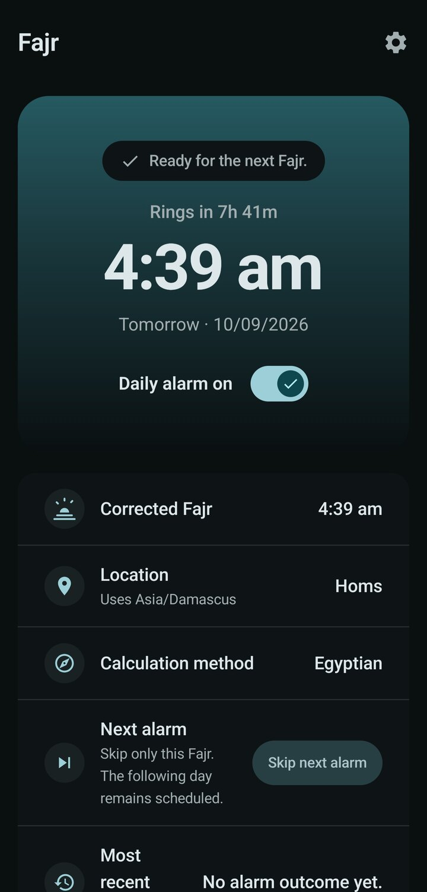
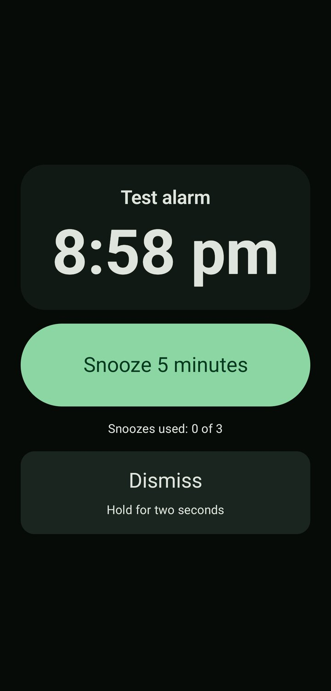
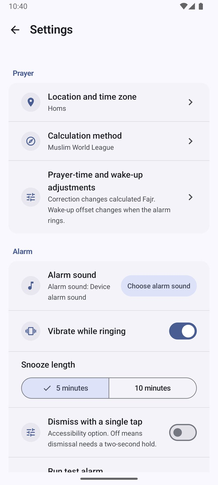

# Alfajr Alarm

A quiet, offline Fajr alarm for Android. Prayer times are calculated on the
device — no account, internet permission, location access, advertising, or
analytics.

## Screenshots

| Home | Ringing | Settings |
| :---: | :---: | :---: |
|  |  |  |
| Next alarm, countdown, and the values it came from | Over the lock screen, snooze or hold to dismiss | Only what a Fajr alarm needs |

## Install

Download the APK from the [latest release](https://github.com/SourceM7/Alfajr/releases/latest).
Requires Android 8.0 (API 26) or newer.

Every release is signed with the same key, so you can confirm a download is
genuine rather than merely intact:

```sh
apksigner verify --print-certs AlfajrAlarm-*.apk
```

The certificate SHA-256 must be
`85c1b94092a4f4f699b01eddc55bcd3b058cb0ef31c6eee383dc1d0a6ee3b543`. A `.sha256`
file is published beside the APK if you only want to check the download
completed.

### Full-screen alarm permission

On Android 14 and newer, a sideloaded build is not granted the *Full screen
notifications* permission automatically. Without it the alarm still rings, but
it arrives as a notification instead of covering the lock screen. The app
reports this on its home screen and links straight to the setting.

## What it does

- One daily alarm at the calculated Fajr time for a fixed city, searched offline
- Ten calculation methods, selected explicitly by the user
- Separate prayer-time correction and wake-up offset, applied in that order
- A full-screen alarm over the lock screen, with snooze and hold-to-dismiss
- Skip a single day without disturbing the recurring alarm
- English and Arabic, with mirrored right-to-left layouts

It is deliberately Fajr-only: no other prayer times, no qibla, no calendar, and
no long-term history.

## Build

```sh
./gradlew assembleDebug
./gradlew test lint
```

Requires JDK 17 and Android SDK Platform 37 with matching build tools.
Releases are built by CI from a signed tag; see [docs/RELEASING.md](docs/RELEASING.md).

## Privacy

The app stores only local preferences and device-local alarm state. It does not
request internet, location, or storage permissions, and the release build is
checked for those at build time. See [the privacy statement](docs/PRIVACY.md).

## License

MIT. See [LICENSE](LICENSE).

Bundled city data is derived from the GeoNames geographical database and is
distributed under CC BY 4.0 with the required attribution. Interface and
launcher icons are Material Symbols, Apache 2.0. See
[third-party notices](docs/THIRD_PARTY_NOTICES.md).
